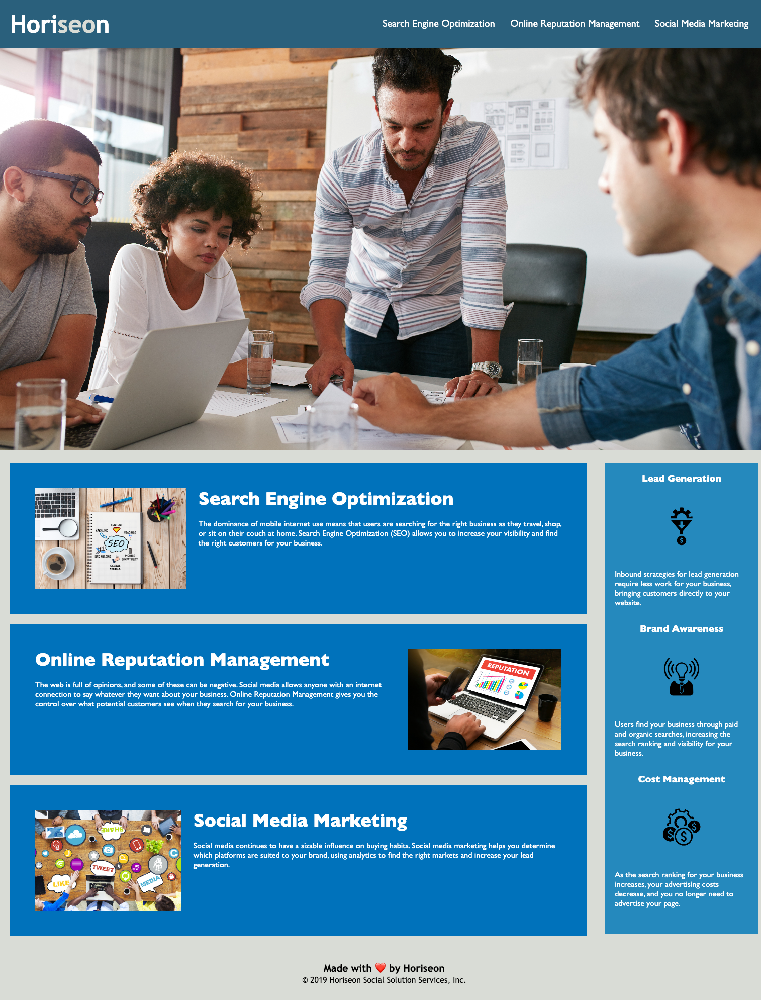

# Module 1 Challenge

## Project Description

This challenge was an on-the-job ticket where I was given starter code to modify. The goal was to make the existing website more accessible without changing what it does. 

---

### Updates Made to HTML Document

* **Semantic HTML**: Many of the `div` tags were changed to semantic elements such as `header`, `nav`, `main`, `section`, and `footer`.
* **Logical Structure**: The elements now follow a logical structure along with correct positioning.
* **Accessible alt Attributes**: `alt` attributes were added to all the images to make them more accessible. The background image in CSS didn't have an `img` tag in HTML, so `role` and `aria-label` tags were added in the HTML document to make that image accessible as well.
* **Heading Attributes**: The heading attributes are accurate and placed in sequential order.
* **Concise, Descriptive Title**: The title now shows the company's name to describe the site. 
* **Working Links**: The `id` was updated for an element to ensure all links were working correctly.

---

### Updates Made to CSS Document

* **Consolidate**: The selectors and properties in CSS are consolidated.
* **Organize**: The selectors and properties follow the semantic structure of the HTML elements.
* **Comments**: Comments are included in the CSS document before each element.

---

### Mock-Up

The following image shows the web application's appearance and functionality:

## Link

The following link will take you to the [Horiseon Website](https://mich-hales.github.io/module-1-challenge/Develop/index.html)

